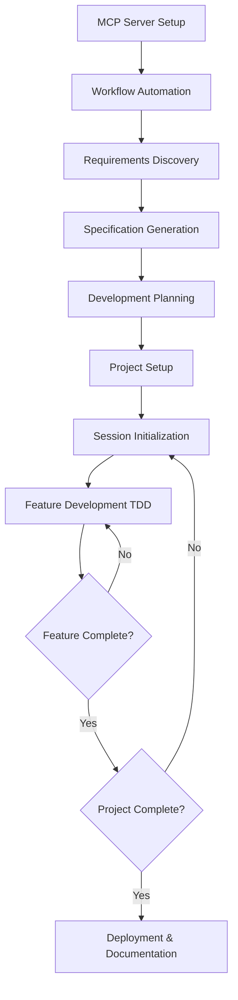

# Claude Code Catalyst 🚀

[](https://github.com/mlitz/claude-code-catalyst)
[](https://opensource.org/licenses/MIT)
[](https://github.com/mlitz/claude-code-catalyst)
[](https://github.com/mlitz/claude-code-catalyst)

> **A comprehensive AI-powered development workflow system that transforms how you build production-ready applications with Claude Code, strict Test-Driven Development, and integrated code quality enforcement.**

Claude Code Catalyst is a battle-tested, 8-prompt workflow system that leverages Claude Code's MCP (Model Context Protocol) servers to create a seamless, intelligent development experience. Whether you're building web applications, APIs, or complex systems, this workflow ensures quality, maintainability, and rapid delivery through enforced TDD practices and automated linting standards.

## ✨ Key Features

- 🔄 **End-to-End Workflow**: From requirements to deployment, with clear validation gates
- 🧪 **Strict TDD Enforcement**: Non-negotiable test-first development with 100% coverage targets
- 🔧 **Integrated Linting**: Automatic language detection and linter setup with pre-commit hooks
- 🤖 **MCP Server Integration**: Leverage 5 powerful AI servers for code analysis, documentation, and more
- 📋 **Automated Project Management**: Dynamic todo tracking and progress monitoring
- 🔒 **Security-First**: Built-in security mandates and vulnerability prevention
- 📚 **Comprehensive Documentation**: Auto-generated specs, API docs, and implementation guides
- 🎯 **Quality Gates**: Automated validation at every step ensures production readiness

## 🚀 Quick Start

### Prerequisites

Before using Claude Code Catalyst, ensure you have:

- **Claude Code** installed and running
- **Node.js** >= 16.0.0 and npm >= 8.0.0
- **Python** and `uvx` for Serena server
- **Git** for version control
- **Docker** (optional, for containerized development)

### 1. Clone the Repository

```bash
git clone https://github.com/mlitz/claude-code-catalyst.git
cd claude-code-catalyst
```

### 2. Set Up MCP Servers

The foundation of this workflow is the MCP server ecosystem. Start with:

```bash
# Use the first prompt to set up all required MCP servers
# Copy and paste the content from prompts/prompt-0-v2.0.md into Claude Code
```

This sets up 5 essential servers:

- **Serena**: Semantic code analysis and intelligent refactoring
- **Context7**: Real-time documentation and code examples
- **Memory**: Persistent context across sessions
- **Filesystem**: Secure file operations
- **GitHub**: Version control and collaboration

### 3. Initialize Your Project

```bash
# Use the workflow automation setup
# Copy content from prompts/prompt-0.5-v2.1.md into Claude Code
```

### 4. Start Building

Follow the sequential prompts to build your application:

1. **Requirements Discovery** (`prompts/prompt-1-v2.0.md` - missing, was in deleted file)
2. **Specification Generation** (`prompts/prompt-2-v3.1.md`)
3. **Development Planning** (`prompts/prompt-3-v2.1.md`)
4. **Project Setup** (`prompts/prompt-4-v2.1.md`)
5. **Daily Development** (`prompts/prompt-5-v2.1.md`)
6. **Feature Implementation** (`prompts/prompt-6-v2.1.md`)

## 📋 Workflow Overview



## 🛠️ Detailed Usage

### Phase 1: Infrastructure Setup (One-time)

#### Prompt 0: MCP Server Configuration V2.0
**File**: `prompts/prompt-0-v2.0.md`
**Duration**: 15-30 minutes
**Purpose**: Install and configure all required MCP servers

This critical first step ensures your Claude Code environment has access to:

- Code analysis and refactoring tools with language support matrix
- Real-time documentation lookup with enhanced error handling
- Persistent memory across sessions
- Secure filesystem operations
- GitHub integration with troubleshooting guide

#### Prompt 0.5: Workflow Automation V2.1
**File**: `prompts/prompt-0.5-v2.1.md`
**Duration**: 10-15 minutes
**Purpose**: Create workflow automation framework with linting integration

Sets up the intelligent automation system with:

- Workflow progress tracking and validation
- Integrated linting standards configuration
- Pre-commit hooks setup
- Language-specific linter configuration
- Quality validation scripts

### Phase 2: Project Initialization (Per Project)

#### Prompt 1: Requirements Discovery V2.0
**File**: `prompts/prompt-1-v2.0.md` (Currently Missing - was in deleted file)
**Duration**: 30-60 minutes
**Purpose**: Systematic requirements gathering

Interactive session that builds complete project understanding through:

- Single-question discovery process
- 4-phase progression (20 questions total)
- Memory server integration
- Complete specification building

#### Prompt 2: Specification Generation V3.1
**File**: `prompts/prompt-2-v3.1.md`
**Duration**: 30-45 minutes
**Purpose**: Create comprehensive project documentation with dynamic linting

Generates production-ready documentation:

- `spec.md`: Complete technical specification
- `CLAUDE.md`: AI development context with TDD rules
- `work-journal.md`: Development tracking system
- Dynamic language detection for linting configuration
- Language-specific coding standards

#### Prompt 3: Development Planning V2.1
**File**: `prompts/prompt-3-v2.1.md`
**Duration**: 20-30 minutes
**Purpose**: Create detailed implementation roadmap with quality enforcement

Uses Claude Code's planning feature enhanced with:

- TDD methodology integration at every task
- Integrated linting at every step
- Granular task breakdown with time estimates
- Quality metrics and gates
- Risk identification and mitigation

#### Prompt 4: Project Setup V2.1
**File**: `prompts/prompt-4-v2.1.md`
**Duration**: 15-20 minutes
**Purpose**: Establish project infrastructure with auto-linter

Creates complete project management system:

- Dynamic todo tracking (`todo.md`) with real-time updates
- Automatic language detection and linter installation
- CI/CD pipeline with linting integration
- Git repository setup with quality gates
- Language-specific linter setup scripts

### Phase 3: Development Execution (Daily)

#### Prompt 5: Session Initialization V2.1
**File**: `prompts/prompt-5-v2.1.md`
**Duration**: 5-10 minutes per session
**Purpose**: Load context and prepare for development with linter verification

Each development session starts with:

- MCP server health checks and verification
- Linter verification and setup validation
- Context recovery from all project documentation
- Session intelligence report generation
- Quality commitment enforcement

#### Prompt 6: Feature Development (TDD) V2.1
**File**: `prompts/prompt-6-v2.1.md`
**Duration**: Variable per feature
**Purpose**: Implement features with strict TDD and integrated linting

The bulletproof development template with 7-phase process:

- **RED**: Write failing tests first (non-negotiable)
- **GREEN**: Implement minimal code to pass
- **REFACTOR**: Improve code quality with linting
- **INTEGRATE**: Connect to system
- **LINT**: Mandatory linting after every code change
- **VALIDATE**: Comprehensive quality gates
- **DOCUMENT**: Complete documentation

## 🎯 TDD & Quality Enforcement

This workflow system implements **non-negotiable TDD practices** with integrated linting:

### The TDD Contract

- ❌ **NEVER** write production code without a failing test
- ✅ **ALWAYS** write tests first (RED phase)
- 🔄 **FOLLOW** Red-Green-Refactor-Lint cycle religiously
- 📊 **MAINTAIN** 100% test coverage targets
- 🚫 **NO EXCEPTIONS** - violations = task failure

### Quality Metrics

- **Test Coverage**: 100% (no exceptions without approval)
- **Linting**: Zero errors, zero warnings
- **Build Time**: < 30 seconds
- **Test Execution**: < 100ms per test
- **Zero Tolerance**: No linting errors, TypeScript errors, or console.logs

### Automated Validation

Each step includes automatic validation:

- Test-first enforcement with absolute language
- Mandatory linting after every code change
- Pre-commit hooks for quality gates
- Coverage verification
- Language-specific code quality checks
- Documentation completeness
- Security compliance

## 🔧 MCP Server Integration

### Serena (Code Analysis)

```bash
# Analyze codebase structure
"Analyze src/services with Serena for code smells"

# Find refactoring opportunities
"Use Serena to identify circular dependencies"
```

### Context7 (Documentation)

```bash
# Research best practices
"use context7 for React 18 testing patterns"

# Find implementation examples
"use context7 to find Express middleware examples"
```

### Memory (Context Preservation)

```bash
# Store decisions
"Remember: We chose PostgreSQL because of ACID requirements"

# Maintain continuity
"Remember: Authentication uses JWT with 1-hour expiry"
```

### GitHub (Version Control)

```bash
# Automated workflows
# Branch management and PR automation
# Issue tracking integration
```

### Filesystem (Secure Operations)

```bash
# All file operations are performed through the filesystem server
# Automatic path validation and security checks
```

## 📁 Project Structure

After running through the workflow, your project will have:

```text
your-project/
├── .github/                    # GitHub workflows with linting CI/CD
├── docs/                       # Generated documentation
│   ├── api/                    # API documentation
│   ├── architecture/           # Architecture decisions
│   └── guides/                 # User and development guides
├── src/                        # Source code (TDD organized)
│   ├── components/             # UI components (if applicable)
│   ├── services/               # Business logic
│   ├── controllers/            # API controllers
│   ├── middleware/             # Express middleware
│   ├── models/                 # Data models
│   ├── utils/                  # Utilities
│   └── types/                  # TypeScript definitions
├── tests/                      # Comprehensive test suite
│   ├── unit/                   # Unit tests
│   ├── integration/            # Integration tests
│   └── e2e/                    # End-to-end tests
├── plan/                       # Workflow automation
│   ├── automation/             # Workflow scripts with linting
│   └── logs/                   # Execution logs
├── .husky/                     # Pre-commit hooks for linting
├── linting-setup.sh            # Auto-generated linter setup script
├── spec.md                     # Technical specification
├── CLAUDE.md                   # AI development context with TDD rules
├── todo.md                     # Dynamic task tracking with real-time updates
├── work-journal.md             # Development journal
└── [config files]             # Package.json, linter configs, etc.
```

## 🔍 Examples

### Web Application Development
See `examples/web-app/` for a complete example of building a React + Express application using this workflow.

### API Development
See `examples/api-service/` for a Node.js REST API implementation example.

### CLI Tool Development
See `examples/cli-tool/` for a TypeScript CLI application example.

## 🚨 Troubleshooting

### Common Issues

#### MCP Servers Not Connected

```bash
# Check server status
/mcp

# If servers show disconnected:
# 1. Exit Claude Code completely
# 2. Wait 10 seconds
# 3. Restart Claude Code
# 4. Verify with /mcp again
```

#### Tests Failing After Setup

```bash
# Verify test environment
npm test -- --detectOpenHandles

# Check for configuration issues
npm run type-check
npm run lint
```

#### Context Loss Between Sessions

```bash
# Ensure Memory server is working
# Use Session Initialization prompt to recover context
# Check work-journal.md for last session notes
```

### Getting Help

1. **Check Documentation**: Review the relevant prompt file
2. **Verify MCP Status**: Ensure all servers are connected
3. **Review Work Journal**: Check previous session notes
4. **Export Conversation**: Use `claude-prompts` for context
5. **Create Issue**: Use GitHub Issues for bug reports

## 🤝 Contributing

We welcome contributions! Please see [CONTRIBUTING.md](./CONTRIBUTING.md) for guidelines.

### Ways to Contribute

- 🐛 **Bug Reports**: Found an issue? Let us know!
- ✨ **Feature Requests**: Ideas for improvements
- 📚 **Documentation**: Help improve our guides
- 🧪 **Examples**: Share your workflow implementations
- 🔧 **Prompt Improvements**: Enhance the workflow templates

### Development Setup

1. Fork the repository
2. Create a feature branch
3. Follow the TDD workflow for any changes
4. Submit a pull request

## 📄 License

This project is licensed under the MIT License - see the [LICENSE](./LICENSE) file for details.

## 🙏 Acknowledgments

- **Anthropic Team**: For Claude Code and MCP server architecture
- **TDD Community**: For establishing test-driven development best practices
- **Open Source Contributors**: For the amazing tools that make this workflow possible

## 📞 Support & Community

- 🐛 **Issues**: [GitHub Issues](https://github.com/mlitz/claude-code-catalyst/issues)
- 💬 **Discussions**: [GitHub Discussions](https://github.com/mlitz/claude-code-catalyst/discussions)
- 📖 **Documentation**: [Full documentation](./docs/)

---

**Ready to revolutionize your development workflow?** Start with the [Quick Start](#quick-start) guide and experience the power of AI-assisted, test-driven development!

*"Quality is not an act, it is a habit." - Aristotle*
