# Claude Code Catalyst 🚀

[](https://github.com/yourusername/claude-code-catalyst)
[](https://opensource.org/licenses/MIT)
[](https://github.com/yourusername/claude-code-catalyst)

> **A comprehensive AI-powered development workflow system that transforms how you build production-ready applications with Claude Code and strict Test-Driven Development practices.**

Claude Code Catalyst is a battle-tested, 8-step workflow system that leverages Claude Code's MCP (Model Context Protocol) servers to create a seamless, intelligent development experience. Whether you're building web applications, APIs, or complex systems, this workflow ensures quality, maintainability, and rapid delivery through enforced TDD practices.

## ✨ Key Features

- 🔄 **End-to-End Workflow**: From requirements to deployment, with clear validation gates
- 🧪 **Strict TDD Enforcement**: Non-negotiable test-first development with 100% coverage targets
- 🤖 **MCP Server Integration**: Leverage 5 powerful AI servers for code analysis, documentation, and more
- 📋 **Automated Project Management**: Dynamic todo tracking and progress monitoring
- 🔒 **Security-First**: Built-in security mandates and vulnerability prevention
- 📚 **Comprehensive Documentation**: Auto-generated specs, API docs, and implementation guides
- 🎯 **Quality Gates**: Automated validation at every step ensures production readiness

## 🚀 Quick Start

### Prerequisites

Before using Claude Code Catalyst, ensure you have:

- **Claude Code** installed and running
- **Node.js** >= 16.0.0 and npm >= 8.0.0
- **Python** and `uvx` for Serena server
- **Git** for version control
- **Docker** (optional, for containerized development)

### 1. Clone the Repository

```bash
git clone https://github.com/yourusername/claude-code-catalyst.git
cd claude-code-catalyst
```

### 2. Set Up MCP Servers

The foundation of this workflow is the MCP server ecosystem. Start with:

```bash
# Use the first prompt to set up all required MCP servers
# Copy and paste the content from prompts/00-mcp-server-setup.md into Claude Code
```

This sets up 5 essential servers:
- **Serena**: Semantic code analysis and intelligent refactoring
- **Context7**: Real-time documentation and code examples
- **Memory**: Persistent context across sessions
- **Filesystem**: Secure file operations
- **GitHub**: Version control and collaboration

### 3. Initialize Your Project

```bash
# Use the workflow automation setup
# Copy content from prompts/01-automated-workflow-setup.md into Claude Code
```

### 4. Start Building

Follow the sequential prompts to build your application:

1. **Requirements Discovery** (`prompts/02-interactive-requirements-discovery.md`)
2. **Specification Generation** (`prompts/03-comprehensive-specification-generation.md`)
3. **Development Planning** (`prompts/04-claude-code-plan-generation.md`)
4. **Project Setup** (`prompts/05-project-setup-todo-management.md`)
5. **Daily Development** (`prompts/06-development-session-initialization.md`)
6. **Feature Implementation** (`prompts/07-tdd-enforcement-template.md`)

## 📋 Workflow Overview

### 🔄 Visual Workflow

```mermaid
graph TD
    A["🔧 MCP Server Setup<br/>(15-30 min)"] --> B["⚙️ Workflow Automation<br/>(10-15 min)"]
    B --> C["📋 Requirements Discovery<br/>(30-60 min)"]
    C --> D["📄 Specification Generation<br/>(30-45 min)"]
    D --> E["🗺️ Development Planning<br/>(20-30 min)"]
    E --> F["🏗️ Project Setup<br/>(15-20 min)"]
    F --> G["🚀 Session Initialization<br/>(5-10 min)"]
    G --> H["🧪 Feature Development<br/>TDD Cycle"]
    H --> I{Feature Complete?}
    I -->|No| H
    I -->|Yes| J{More Features?}
    J -->|Yes| G
    J -->|No| K["✅ Project Complete<br/>Deploy & Document"]
    
    style A fill:#ffffff,stroke:#000000,stroke-width:3px,color:#000000
    style B fill:#ffffff,stroke:#000000,stroke-width:3px,color:#000000
    style C fill:#ffffff,stroke:#000000,stroke-width:3px,color:#000000
    style D fill:#ffffff,stroke:#000000,stroke-width:3px,color:#000000
    style E fill:#ffffff,stroke:#000000,stroke-width:3px,color:#000000
    style F fill:#ffffff,stroke:#000000,stroke-width:3px,color:#000000
    style G fill:#ffffff,stroke:#000000,stroke-width:3px,color:#000000
    style H fill:#ffffff,stroke:#000000,stroke-width:3px,color:#000000
    style I fill:#ffffff,stroke:#000000,stroke-width:3px,color:#000000
    style J fill:#ffffff,stroke:#000000,stroke-width:3px,color:#000000
    style K fill:#ffffff,stroke:#000000,stroke-width:3px,color:#000000
```



### 📝 Step-by-Step Workflow

#### Phase 1: One-Time Setup (Do Once)
```
Step 0   │ MCP Server Setup          │ 15-30 min │ Configure 5 essential servers
Step 0.5 │ Workflow Automation       │ 10-15 min │ Create automation framework
```

#### Phase 2: Per Project (For Each New Project)
```
Step 1   │ Requirements Discovery    │ 30-60 min │ Gather comprehensive requirements
Step 2   │ Specification Generation  │ 30-45 min │ Create spec.md + CLAUDE.md  
Step 3   │ Development Planning      │ 20-30 min │ Generate TDD-enhanced plan
Step 4   │ Project Setup            │ 15-20 min │ Initialize infrastructure
```

#### Phase 3: Daily Development (Repeat Daily)
```
Step 5   │ Session Initialization   │  5-10 min │ Load context & verify health
Step 6   │ Feature Development      │ Variable  │ TDD cycle: RED→GREEN→REFACTOR
         │ ↳ Repeat Step 6 for each feature
```

### 🎯 Quick Reference

| Prompt File | Purpose | When to Use |
|-------------|---------|-------------|
| `00-mcp-server-setup.md` | Install MCP servers | **Once** - Initial setup |
| `01-automated-workflow-setup.md` | Create automation | **Once** - After MCP setup |
| `02-interactive-requirements-discovery.md` | Gather requirements | **Per project** - New projects |
| `03-comprehensive-specification-generation.md` | Create specifications | **Per project** - After requirements |
| `04-claude-code-plan-generation.md` | Generate development plan | **Per project** - After specs |
| `05-project-setup-todo-management.md` | Setup infrastructure | **Per project** - After planning |
| `06-development-session-initialization.md` | Start daily session | **Daily** - Every dev session |
| `07-tdd-enforcement-template.md` | Implement features | **Per feature** - Development work |

### 🔁 Development Cycle

```
Daily Development Loop:
┌─────────────────────────────────────────┐
│ 1. Session Init (Step 5)               │
│ 2. Pick feature from todo.md           │
│ 3. Use TDD Template (Step 6):          │
│    ├─ Write failing tests (RED)        │
│    ├─ Implement minimal code (GREEN)   │
│    ├─ Refactor & improve (REFACTOR)    │
│    └─ Document & commit                │
│ 4. Update todo.md progress             │
│ 5. Export conversation (JSON)          │
└─────────────────────────────────────────┘
         ↓
    Repeat until project complete
```

## 🛠️ Detailed Usage

### Phase 1: Infrastructure Setup (One-time)

#### Step 0: MCP Server Configuration
**File**: `prompts/00-mcp-server-setup.md`
**Duration**: 15-30 minutes
**Purpose**: Install and configure all required MCP servers

This critical first step ensures your Claude Code environment has access to:
- Code analysis and refactoring tools
- Real-time documentation lookup
- Persistent memory across sessions
- Secure filesystem operations
- GitHub integration

#### Step 0.5: Workflow Automation
**File**: `prompts/01-automated-workflow-setup.md`
**Duration**: 10-15 minutes
**Purpose**: Create workflow automation framework

Sets up the intelligent automation system that tracks your progress, validates steps, and maintains project state.

### Phase 2: Project Initialization (Per Project)

#### Step 1: Requirements Discovery
**File**: `prompts/02-interactive-requirements-discovery.md`
**Duration**: 30-60 minutes
**Purpose**: Systematic requirements gathering

Interactive session that builds complete project understanding through:
- Core functionality identification
- User persona development
- Technical constraint analysis
- Success criteria definition

#### Step 2: Specification Generation
**File**: `prompts/03-comprehensive-specification-generation.md`
**Duration**: 30-45 minutes
**Purpose**: Create comprehensive project documentation

Generates production-ready documentation:
- `spec.md`: Complete technical specification
- `CLAUDE.md`: AI development context with TDD rules
- `work-journal.md`: Development tracking system

#### Step 3: Development Planning
**File**: `prompts/04-claude-code-plan-generation.md`
**Duration**: 20-30 minutes
**Purpose**: Create detailed implementation roadmap

Uses Claude Code's planning feature enhanced with:
- TDD methodology integration
- Task granularity and time estimates
- Risk identification and mitigation
- MCP server utilization strategy

#### Step 4: Project Setup
**File**: `prompts/05-project-setup-todo-management.md`
**Duration**: 15-20 minutes
**Purpose**: Establish project infrastructure

Creates complete project management system:
- Dynamic todo tracking (`todo.md`)
- Git repository setup
- Development environment configuration
- Quality gates and automation

### Phase 3: Development Execution (Daily)

#### Step 5: Session Initialization
**File**: `prompts/06-development-session-initialization.md`
**Duration**: 5-10 minutes per session
**Purpose**: Load context and prepare for development

Each development session starts with:
- MCP server health verification
- Context recovery from previous sessions
- Repository status analysis
- Session planning and prioritization

#### Step 6: Feature Development (TDD)
**File**: `prompts/07-tdd-enforcement-template.md`
**Duration**: Variable per feature
**Purpose**: Implement features with strict TDD

The core development template that ensures:
- **RED**: Write failing tests first
- **GREEN**: Implement minimal code to pass
- **REFACTOR**: Improve code quality
- **INTEGRATE**: Connect to system
- **DOCUMENT**: Comprehensive documentation

## 🎯 TDD Enforcement

This workflow system implements **non-negotiable TDD practices**:

### The TDD Contract

- ❌ **NEVER** write production code without a failing test
- ✅ **ALWAYS** write tests first (RED phase)
- 🔄 **FOLLOW** Red-Green-Refactor cycle religiously
- 📊 **MAINTAIN** 100% test coverage targets
- 🚫 **NO EXCEPTIONS** - violations = task failure

### Quality Metrics

- **Test Coverage**: 100% (no exceptions without approval)
- **Build Time**: < 30 seconds
- **Test Execution**: < 100ms per test
- **Zero Tolerance**: No linting errors, TypeScript errors, or console.logs

### Automated Validation

Each step includes automatic validation:
- Test-first enforcement
- Coverage verification
- Code quality checks
- Documentation completeness
- Security compliance

## 🔧 MCP Server Integration

### Serena (Code Analysis)
```bash
# Analyze codebase structure
"Analyze src/services with Serena for code smells"

# Find refactoring opportunities
"Use Serena to identify circular dependencies"
```

### Context7 (Documentation)
```bash
# Research best practices
"use context7 for React 18 testing patterns"

# Find implementation examples
"use context7 to find Express middleware examples"
```

### Memory (Context Preservation)
```bash
# Store decisions
"Remember: We chose PostgreSQL because of ACID requirements"

# Maintain continuity
"Remember: Authentication uses JWT with 1-hour expiry"
```

### GitHub (Version Control)
```bash
# Automated workflows
# Branch management and PR automation
# Issue tracking integration
```

### Filesystem (Secure Operations)
```bash
# All file operations are performed through the filesystem server
# Automatic path validation and security checks
```

## 📁 Project Structure

After running through the workflow, your project will have:

```
your-project/
├── .github/                    # GitHub workflows and templates
├── docs/                       # Generated documentation
│   ├── api/                    # API documentation
│   ├── architecture/           # Architecture decisions
│   └── guides/                 # User and development guides
├── src/                        # Source code (TDD organized)
│   ├── components/             # UI components (if applicable)
│   ├── services/               # Business logic
│   ├── controllers/            # API controllers
│   ├── middleware/             # Express middleware
│   ├── models/                 # Data models
│   ├── utils/                  # Utilities
│   └── types/                  # TypeScript definitions
├── tests/                      # Comprehensive test suite
│   ├── unit/                   # Unit tests
│   ├── integration/            # Integration tests
│   └── e2e/                    # End-to-end tests
├── plan/                       # Workflow automation
│   ├── automation/             # Workflow scripts
│   └── logs/                   # Execution logs
├── spec.md                     # Technical specification
├── CLAUDE.md                   # AI development context
├── todo.md                     # Dynamic task tracking
├── work-journal.md             # Development journal
└── [standard config files]    # Package.json, tsconfig, etc.
```

## 🔍 Examples

### Web Application Development
See `examples/web-app/` for a complete example of building a React + Express application using this workflow.

### API Development
See `examples/api-service/` for a Node.js REST API implementation example.

### CLI Tool Development
See `examples/cli-tool/` for a TypeScript CLI application example.

## 🚨 Troubleshooting

### Common Issues

#### MCP Servers Not Connected
```bash
# Check server status
/mcp

# If servers show disconnected:
# 1. Exit Claude Code completely
# 2. Wait 10 seconds
# 3. Restart Claude Code
# 4. Verify with /mcp again
```

#### Tests Failing After Setup
```bash
# Verify test environment
npm test -- --detectOpenHandles

# Check for configuration issues
npm run type-check
npm run lint
```

#### Context Loss Between Sessions
```bash
# Ensure Memory server is working
# Use Session Initialization prompt to recover context
# Check work-journal.md for last session notes
```

### Getting Help

1. **Check Documentation**: Review the relevant prompt file
2. **Verify MCP Status**: Ensure all servers are connected
3. **Review Work Journal**: Check previous session notes
4. **Export Conversation**: Use `claude-prompts` for context
5. **Create Issue**: Use GitHub Issues for bug reports

## 📤 Conversation Export & Documentation

**IMPORTANT**: To help improve this workflow system and share your implementation experiences, please export your Claude Code conversations in JSON format.

### Why Export Conversations?

- **Workflow Improvement**: Your conversations help identify pain points and optimization opportunities
- **Example Creation**: Real conversations become valuable examples for other developers
- **Pattern Recognition**: Helps identify common issues and successful patterns
- **Community Learning**: Anonymized conversations can be used to improve documentation

### How to Export (Required Setup)

The workflow includes the `claude-code-exporter` tool for conversation management:

```bash
# Install the export tool (done during MCP setup)
npm install -g claude-code-exporter

# Verify installation
claude-prompts --help
```

### Export Commands

```bash
# Export current session in JSON format
claude-prompts --json

# Export current session to specific file
claude-prompts --json --output my-project-session.json

# Export all conversations from last 7 days
claude-prompts --json --period=7d --output weekly-conversations.json

# Export specific conversation by ID
claude-prompts --json --session-id <session-id> --output specific-session.json

# List available sessions to get IDs
claude-prompts --list
```

### 📋 Export Best Practices

#### When to Export

- **After each major workflow step** (requirements, specification, planning, etc.)
- **End of each development session**
- **When encountering issues or breakthroughs**
- **After completing features or milestones**
- **Before major refactoring or architectural changes**

#### Export Naming Convention

Use descriptive filenames to organize exports:

```bash
# Project initialization
claude-prompts --json --output project-name-01-requirements.json
claude-prompts --json --output project-name-02-specification.json
claude-prompts --json --output project-name-03-planning.json

# Development sessions
claude-prompts --json --output project-name-dev-session-YYYY-MM-DD.json

# Feature development
claude-prompts --json --output project-name-feature-authentication.json
claude-prompts --json --output project-name-feature-api-endpoints.json
```

#### What to Include in Exports

**Essential Exports:**
- [ ] Complete workflow runs (all 8 steps)
- [ ] TDD implementation sessions
- [ ] Problem-solving conversations
- [ ] Successful feature implementations
- [ ] Error resolution sessions

**Valuable Exports:**
- [ ] MCP server troubleshooting
- [ ] Architecture decision discussions
- [ ] Performance optimization sessions
- [ ] Security implementation conversations
- [ ] Testing strategy development

### 🔒 Privacy & Security

#### Before Exporting

**ALWAYS review exports for sensitive information:**

```bash
# Review export content before sharing
cat your-export.json | grep -i -E "(password|secret|key|token|credential)"

# Remove sensitive data if found
# Edit the JSON file to redact private information
```

#### Safe to Share

- ✅ General development patterns and solutions
- ✅ TDD implementation strategies
- ✅ MCP server usage examples
- ✅ Architecture discussions (without business secrets)
- ✅ Error messages and troubleshooting steps
- ✅ Code examples (without proprietary logic)

#### DO NOT Share

- ❌ API keys, passwords, or credentials
- ❌ Proprietary business logic or algorithms
- ❌ Private company information
- ❌ Personal information (emails, names, addresses)
- ❌ Internal URLs or server configurations
- ❌ Database schemas with sensitive data

### 📊 Sharing Your Exports

#### For Workflow Improvement

Email JSON exports to: **claude-code-catalyst@example.com**

**Subject Line Format:**
- `[EXPORT] Project Type - Workflow Step - Brief Description`
- Examples:
  - `[EXPORT] React App - Complete Workflow - E-commerce Platform`
  - `[EXPORT] API Service - TDD Session - Authentication Implementation`
  - `[EXPORT] CLI Tool - Troubleshooting - MCP Server Issues`

#### For Community Examples

Create a GitHub issue with:
- **Title**: `[EXAMPLE] Project Type: Brief Description`
- **Attach**: Sanitized JSON export
- **Include**: Brief project description and key learnings
- **Tag**: `example`, `documentation`

#### For Bug Reports

If your export contains error reproduction:
- **Title**: `[BUG] Brief Error Description`
- **Attach**: Relevant JSON export sections
- **Include**: Steps to reproduce and expected behavior
- **Tag**: `bug`, `needs-investigation`

### 📈 Export Analytics

Your exports help us understand:

- **Common workflow patterns** and successful implementations
- **Frequent pain points** and areas needing improvement
- **MCP server usage patterns** and optimization opportunities
- **TDD adoption challenges** and solutions
- **Documentation gaps** and unclear instructions

### 🎯 Export Goals

Help us reach these community goals:

- **100 Complete Workflow Exports**: Full project implementations
- **500 Feature Development Sessions**: TDD implementation examples
- **50 Problem Resolution Sessions**: Troubleshooting and solutions
- **25 Architecture Decision Sessions**: Design pattern discussions

**Your contributions make this workflow system better for everyone!**

### Example Export Session

```bash
# Start new project session
claude-prompts --start-session "MyApp Requirements Discovery"

# ... work through requirements prompt ...

# Export the session
claude-prompts --json --output myapp-requirements-2025-01-04.json

# Continue to next step
claude-prompts --start-session "MyApp Specification Generation"

# ... work through specification prompt ...

# Export specification session
claude-prompts --json --output myapp-specification-2025-01-04.json
```

## 🤝 Contributing

We welcome contributions! Please see [CONTRIBUTING.md](./CONTRIBUTING.md) for guidelines.

### Ways to Contribute

- 🐛 **Bug Reports**: Found an issue? Let us know!
- ✨ **Feature Requests**: Ideas for improvements
- 📚 **Documentation**: Help improve our guides
- 🧪 **Examples**: Share your workflow implementations
- 🔧 **Prompt Improvements**: Enhance the workflow templates

### Development Setup

1. Fork the repository
2. Create a feature branch
3. Follow the TDD workflow for any changes
4. Submit a pull request

## 📄 License

This project is licensed under the MIT License - see the [LICENSE](./LICENSE) file for details.

## 🙏 Acknowledgments

- **Anthropic Team**: For Claude Code and MCP server architecture
- **TDD Community**: For establishing test-driven development best practices
- **Open Source Contributors**: For the amazing tools that make this workflow possible

## 📞 Support & Community

- 🐛 **Issues**: [GitHub Issues](https://github.com/yourusername/claude-code-catalyst/issues)
- 💬 **Discussions**: [GitHub Discussions](https://github.com/yourusername/claude-code-catalyst/discussions)
- 📧 **Email**: claude-code-catalyst@example.com
- 📖 **Documentation**: [Full documentation](./docs/)

---

**Ready to revolutionize your development workflow?** Start with the [Quick Start](#quick-start) guide and experience the power of AI-assisted, test-driven development!

*"Quality is not an act, it is a habit." - Aristotle*