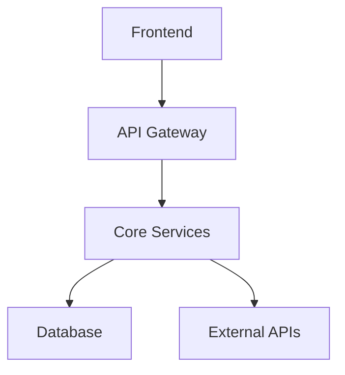
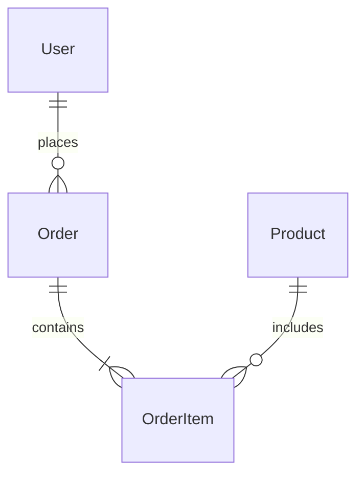

# Prompt #2 V3.0: Comprehensive Specification Generation

**Version**: 3.0
**Last Updated**: January 2025
**Purpose**: Create comprehensive project specification files with enhanced structure, better MCP integration, and research-based CLAUDE.md implementation

**Usage**: Use this after requirements discovery (Prompt #1 V2.0). This generates all specification files with improved organization and TDD enforcement.

```
Based on our requirements discovery, I'll now create comprehensive specification files using the filesystem server. Each file will be created with specific content tailored to your project.

**CRITICAL REQUIREMENTS:**
1. Use filesystem server for ALL file creation
2. Confirm each file creation before proceeding
3. Include concrete examples and code snippets
4. Make specifications actionable and measurable
5. Integrate MCP server usage throughout
6. Enforce TDD methodology through absolute language

**FILES TO CREATE:**

**FILE 1: spec.md**
Create comprehensive specification containing:

# [Project Name] Specification

## Executive Summary
- **Problem Statement**: [Clear problem definition]
- **Solution Overview**: [High-level solution approach]
- **Key Benefits**: [3-5 primary benefits]
- **Success Metrics**: [Measurable success criteria]

## User Personas & Use Cases
### Primary Users
- **Persona 1**: [Name, role, needs, pain points]
- **User Journey**: [Step-by-step workflow]

### Use Cases
1. **[Use Case Name]**
   - Actor: [User type]
   - Preconditions: [Requirements]
   - Flow: [Numbered steps]
   - Postconditions: [Expected outcome]

## Functional Requirements
### Core Features
1. **[Feature Name]**
   - Description: [What it does]
   - Acceptance Criteria:
     - [ ] [Specific, testable criterion]
     - [ ] [Another criterion]
   - Priority: [High/Medium/Low]
   - Dependencies: [Other features/systems]

## Technical Architecture
### System Overview


### Technology Stack
- **Frontend**: [Framework, libraries, tools]
- **Backend**: [Language, framework, libraries]
- **Database**: [Type, specific technology]
- **Infrastructure**: [Hosting, CI/CD, monitoring]
- **MCP Integration**:
  - Serena: [Code analysis use cases]
  - Context7: [Documentation needs]
  - GitHub: [Version control strategy]

### API Design
```yaml
/api/v1/resource:
  get:
    description: Retrieve resources
    parameters:
      - name: id
        type: string
    responses:
      200:
        schema:
          type: object
```

## Data Models
### Entity Relationship


### Schema Definitions
```typescript
interface User {
  id: string;
  email: string;
  profile: UserProfile;
  createdAt: Date;
  updatedAt: Date;
}
```

## Security Requirements
### Authentication & Authorization
- **Method**: [JWT/OAuth/etc]
- **Roles**: [Admin, User, Guest]
- **Permissions Matrix**:
  | Role | Create | Read | Update | Delete |
  |------|--------|------|--------|--------|
  | Admin| ✓      | ✓    | ✓      | ✓      |

### Data Protection
- **Encryption**: [At rest, in transit]
- **PII Handling**: [Specific measures]
- **Compliance**: [GDPR, CCPA, etc]

## Performance Requirements
- **Response Time**: [95th percentile targets]
- **Throughput**: [Requests per second]
- **Availability**: [Uptime percentage]
- **Scalability**: [Growth projections]

## Testing Strategy
### Test Pyramid
- **Unit Tests**: 100% coverage REQUIRED
- **Integration Tests**: All API endpoints
- **E2E Tests**: Critical user flows
- **Performance Tests**: Load and stress

### TDD Approach (NON-NEGOTIABLE)
1. Write failing test FIRST - no exceptions
2. Implement MINIMAL code to pass
3. Refactor while keeping tests green
4. Every line of production code must have a test

## Deployment & DevOps
### Environments
- **Development**: Local Docker setup
- **Staging**: Mirror of production
- **Production**: [Cloud provider, region]

### CI/CD Pipeline
```yaml
stages:
  - test        # Must pass 100%
  - lint        # Zero warnings
  - build       # < 30 seconds
  - deploy      # Automated
```

## Project Timeline
### Phase 1: Foundation (Weeks 1-2)
- [ ] Development environment setup
- [ ] Core architecture implementation
- [ ] Basic CI/CD pipeline

### Phase 2: Core Features (Weeks 3-6)
- [ ] [Feature 1 implementation]
- [ ] [Feature 2 implementation]

## Risk Assessment
| Risk | Probability | Impact | Mitigation |
|------|------------|--------|------------|
| [Risk description] | High/Med/Low | High/Med/Low | [Strategy] |

**FILE 2: CLAUDE.md**
Create AI-optimized context file using research-based best practices:

# CLAUDE.md - AI Development Partner Configuration

## 🎯 PROJECT CONTEXT
**Project**: [Project Name]
**Type**: [Web App/API/Library/CLI]
**Stage**: [Setup/Development/Testing/Production]
**Team Size**: [Solo/Small/Medium/Large]

## ⚡ CRITICAL RULES - VIOLATIONS = TASK FAILURE

### TEST-DRIVEN DEVELOPMENT IS NON-NEGOTIABLE
1. **NO PRODUCTION CODE** without a failing test - ZERO EXCEPTIONS
2. **EVERY LINE** of production code must be written in response to a failing test
3. **Red-Green-Refactor** is the ONLY acceptable workflow:
   - RED: Write a failing test first
   - GREEN: Write MINIMUM code to pass
   - REFACTOR: Improve code with tests passing
4. **NEVER** write tests and implementation simultaneously
5. **NEVER** modify tests to match broken code
6. **ALWAYS** verify test failure before implementing

### SECURITY MANDATES
- **NEVER** commit secrets, credentials, or API keys
- **NEVER** log sensitive data (PII, passwords, tokens)
- **ALWAYS** validate and sanitize ALL inputs
- **ALWAYS** use parameterized queries - NO string concatenation

### CODE QUALITY STANDARDS
- **NO** TypeScript `any` types - use `unknown` and narrow
- **NO** ignored linting errors - fix them properly
- **NO** console.log in production code
- **NO** commented-out code in commits
- **ALWAYS** handle errors explicitly

## 🛠️ TECH STACK
```yaml
Language: TypeScript 5.x (strict mode REQUIRED)
Runtime: Node.js 20.x LTS
Framework: [Specific framework from spec]
Database: [Specific database from spec]
Testing: Jest 29.x + Supertest
Linting: ESLint + Prettier
Build: [Build tool from spec]
```

## 📁 PROJECT STRUCTURE
```
src/
├── components/     # UI components (if applicable)
├── services/       # Business logic - FULLY TESTED
├── controllers/    # HTTP handlers - INTEGRATION TESTED
├── middleware/     # Express middleware - UNIT TESTED
├── models/         # Data models - VALIDATED
├── utils/          # Helpers - 100% COVERAGE
├── types/          # TypeScript definitions
└── __tests__/      # Test files mirror src structure
```

## 🧪 TDD WORKFLOW - FOLLOW EXACTLY

### Phase 1: RED (Write Failing Test)
```typescript
// ALWAYS start here - example pattern
describe('UserService', () => {
  it('should create user with valid data', async () => {
    // Arrange
    const userData = { email: 'test@example.com', name: 'Test User' };
    
    // Act
    const result = await userService.create(userData);
    
    // Assert
    expect(result).toBeDefined();
    expect(result.email).toBe(userData.email);
    expect(result.id).toBeDefined();
  });
});
```

### Phase 2: GREEN (Minimal Implementation)
```typescript
// Write ONLY enough to pass the test
async create(userData: CreateUserDto): Promise<User> {
  // Minimal implementation - no extras!
  const user = new User(userData);
  return this.repository.save(user);
}
```

### Phase 3: REFACTOR (Improve Quality)
- Extract common patterns
- Improve naming
- Add error handling
- Optimize performance
- **Tests must stay GREEN**

## 📋 TESTING REQUIREMENTS

### Coverage Targets
- **Overall**: 100% (exceptions require team approval)
- **Branches**: 100% (all if/else paths)
- **Functions**: 100%
- **Lines**: 100%

### Test Categories
```typescript
// Unit Tests - src/**/*.test.ts
describe('Pure Functions', () => {
  // Test business logic in isolation
  // Mock ALL external dependencies
  // Focus on behavior, not implementation
});

// Integration Tests - src/**/*.integration.test.ts
describe('API Endpoints', () => {
  // Test full request/response cycle
  // Use test database
  // Verify error handling
});

// E2E Tests - e2e/**/*.spec.ts
describe('User Flows', () => {
  // Test critical user journeys
  // Run against staging environment
});
```

## 💻 DEVELOPMENT COMMANDS

### Essential Commands
```bash
# Development
npm run dev          # Start with hot reload
npm run build        # Production build
npm run type-check   # TypeScript validation

# Testing - RUN FREQUENTLY
npm test            # Run all tests
npm run test:watch  # TDD mode - KEEP RUNNING
npm run test:coverage # Verify 100% coverage
npm run test:integration # API tests

# Quality
npm run lint        # ESLint check
npm run lint:fix    # Auto-fix issues
npm run format      # Prettier formatting

# Git Workflow
git checkout -b feature/ticket-description
git add -p          # Review changes
git commit -m "type(scope): description"
git push origin feature/ticket-description
```

## 🔄 MCP SERVER INTEGRATION

### Serena (Code Analysis)
```bash
# Before refactoring
"Analyze src/services with Serena for code smells"
"Use Serena to find unused dependencies"
"Check circular dependencies with Serena"
```

### Context7 (Documentation)
```bash
# Research before implementing
"use context7 for [framework] v[version] patterns"
"use context7 to find [database] best practices"
"use context7 for security guidelines"
```

### Filesystem Operations
```bash
# ALWAYS use for file operations
"Create test file: src/services/__tests__/[name].test.ts"
"Update file: src/types/[name].ts"
```

### Memory (Context Preservation)
```bash
# Store important decisions
"Remember: We chose [decision] because..."
"Remember: [Feature] uses [pattern] for [reason]"
```

## 🚫 DO NOT - AUTOMATIC FAILURE

### Testing Violations
- ❌ Write implementation before tests
- ❌ Skip the RED phase
- ❌ Write multiple features without commits
- ❌ Merge with failing tests
- ❌ Reduce coverage below 100%

### Code Violations  
- ❌ Use `any` type in TypeScript
- ❌ Ignore ESLint errors
- ❌ Leave console.log statements
- ❌ Commit commented code
- ❌ Use relative imports between modules

### Security Violations
- ❌ Store secrets in code
- ❌ Log sensitive information  
- ❌ Use string concatenation for queries
- ❌ Trust user input without validation
- ❌ Expose stack traces to users

### Process Violations
- ❌ Push directly to main branch
- ❌ Merge without PR review
- ❌ Deploy without tests passing
- ❌ Skip documentation updates
- ❌ Ignore error handling

## 📈 QUALITY METRICS

### Code Health Indicators
- ✅ 100% test coverage maintained
- ✅ 0 ESLint warnings
- ✅ 0 TypeScript errors
- ✅ All tests < 100ms
- ✅ Build time < 30s

### Review Checklist
- [ ] Tests written first (check commit history)
- [ ] All tests passing
- [ ] Coverage maintained/increased
- [ ] No linting errors
- [ ] Documentation updated
- [ ] Error handling complete
- [ ] Security considered

## 🎯 SESSION WORKFLOW

### Start of Session
1. Load context with Prompt #5 V2.0
2. Verify MCP servers connected
3. Check test coverage status
4. Review todo.md priorities

### During Development
1. Pick task from todo.md
2. Write failing test FIRST
3. Implement minimal solution
4. Refactor if needed
5. Commit with descriptive message
6. Update documentation

### End of Session
1. Ensure all tests pass
2. Check coverage hasn't dropped
3. Update work-journal.md
4. Export conversation
5. Push all commits

---

**REMEMBER**: This document is your contract. Violations mean task failure. When in doubt, choose quality over speed. Tests first, always.

**FILE 3: work-journal.md**
Initialize development journal:

# [Project Name] Work Journal

## Project Kickoff - [DATE]

### Requirements Summary
Key requirements gathered:
- [Requirement 1]
- [Requirement 2]
- [Requirement 3]

### Technical Decisions
1. **Stack Selection**: [Stack] because [reasons]
2. **Architecture Pattern**: [Pattern] for [benefits]
3. **Testing Framework**: Jest/Supertest for TDD enforcement

### TDD Commitment
- ✅ Team agrees to 100% TDD approach
- ✅ No production code without failing tests
- ✅ Coverage targets set at 100%
- ✅ CLAUDE.md configured with TDD enforcement

### MCP Server Configuration
- ✅ All 5 servers verified and operational
- ✅ Filesystem paths configured: [paths]
- ✅ GitHub authentication completed
- ✅ Memory server initialized with project context
- ✅ Export tool installed for documentation

### Initial Project Setup
- [ ] Repository created
- [ ] Development environment configured
- [ ] Dependencies installed
- [ ] Basic project structure created
- [ ] CI/CD pipeline setup

### Risk Factors Identified
1. **[Risk]**: Mitigation plan: [strategy]
2. **[Risk]**: Mitigation plan: [strategy]

### Next Session Priorities
1. [Priority 1]
2. [Priority 2]
3. [Priority 3]

### Questions for Clarification
- [Question 1]
- [Question 2]

### Time Tracking
- Requirements gathering: [X hours]
- Specification writing: [X hours]
- Environment setup: [X hours]

### Lessons Learned
- [Insight 1]
- [Insight 2]

---

## Session 2 - [DATE]
[Future session notes will go here]

**VERIFICATION STEPS:**
After creating all files:

1. Confirm files exist:
   - Run: List files in current directory
   - Verify spec.md, CLAUDE.md, work-journal.md present

2. Update memory server with:
   - Project name and description
   - Technology stack decisions
   - Key architectural choices
   - TDD enforcement commitment
   - Testing requirements
   - Next development priorities

3. Export initial documentation:
   ```bash
   claude-prompts --json .
   ```

4. Validate CLAUDE.md enforcement:
   - Confirm TDD rules are absolute
   - Verify security mandates are clear
   - Check that "DO NOT" section is comprehensive

The specification is now complete with research-based best practices and ready for TDD-enforced development!
```